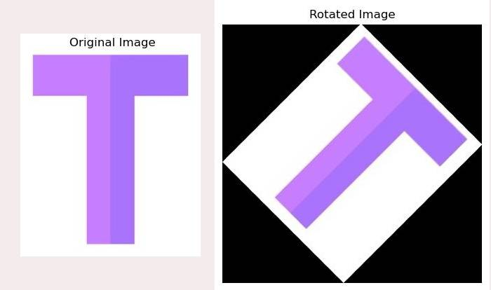
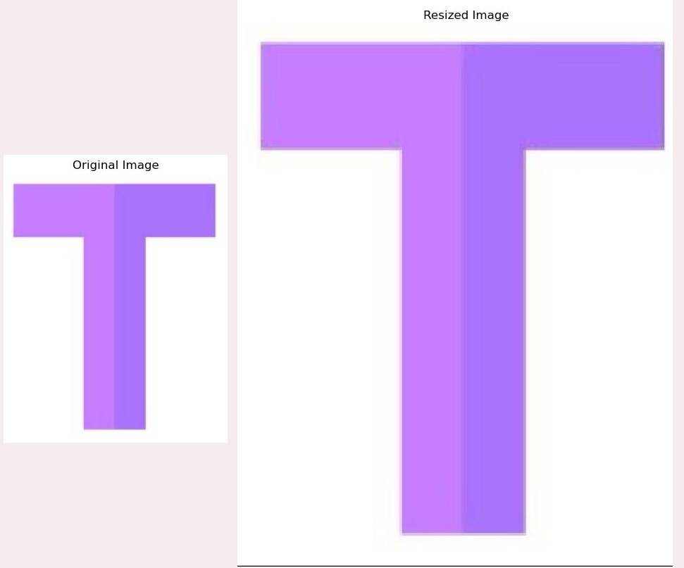
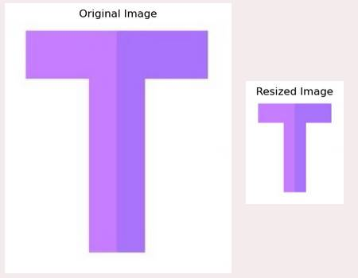
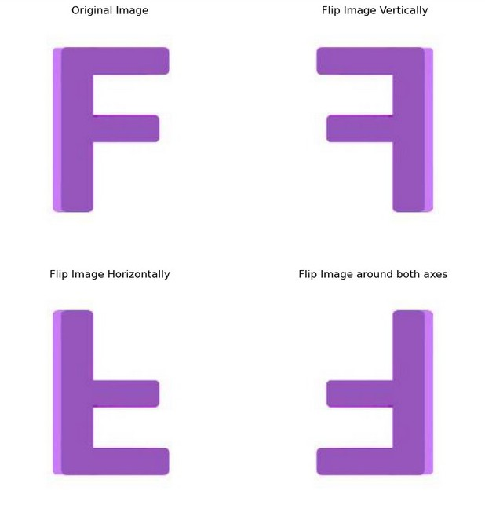

# Week 7: Geometric Transformations Exercise

### **Overview**

This Jupyter notebook provides exercises on geometric transformations using OpenCV. The transformations include image rotation, resizing, and flipping.

### **Contents**

**1. Section 0: Import**
- Import necessary libraries

**2. Section 1: from Scratch**

- **Rotate:** 
  - Implementation of image rotation using vectorized techniques. (Rotated Image with Same Size of Input Image)
  - Implementation of Rotated Image Larger than Input (No Loss of Input Area)
  - Display the original and rotated images.  
  

      
  
  

- **Resize:**
  - Resize the image using nearest interpolation method
  - Display the resized images  
 
  

      
  
  

  

      
  
  

 - **Flip:**
   - Flip the image vertically, horizontally, and around both axes using a custom function.
   - Display the flipped images  

 

      
  
  
